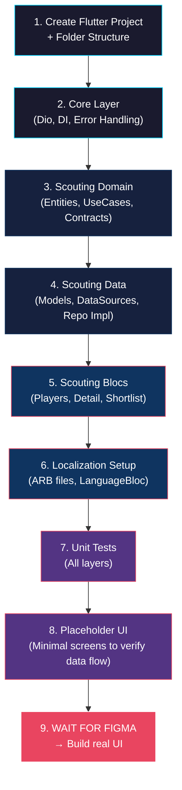

# 🏗️ Sportify — Flutter Architecture Proposal (v1.0)

> **Author:** Senior Flutter Architect (AI Tech Lead)
> **Date:** September 30, 2026
> **Status:** 📋 Under Discussion — Awaiting Intern Approval
> **Scope:** Phase 1 MVP — Starting with Scouting Module

---

## Table of Contents

1. [Executive Summary](#1-executive-summary)
2. [State Management: Bloc vs. Riverpod — The Verdict](#2-state-management-bloc-vs-riverpod)
3. [Project Folder Structure](#3-project-folder-structure)
4. [Networking & API Handling](#4-networking--api-handling)
5. [Localization Strategy (EN / DE / AR + RTL)](#5-localization-strategy)
6. [Separation of Concerns — The Layered Architecture](#6-separation-of-concerns)
7. [API Contract Analysis (Live Data)](#7-api-contract-analysis)
8. [Code Generation: freezed + json_serializable — Tradeoffs](#8-code-generation-tradeoffs)
9. [Dependency Injection Strategy](#9-dependency-injection-strategy)
10. [Action Items & Next Steps](#10-action-items--next-steps)

---

## 1. Executive Summary

Sportify is not a simple CRUD app — it's a **multi-module, multi-role, multi-language platform** with ambitions spanning from professional networking to Web3. This demands an architecture that is:

| Principle | Why |
|---|---|
| **Scalable** | Phase 1 is 5% of the final product. The foundation must support 5 more phases. |
| **Modular** | Features (Scouting, FIT-Pass, Shorts, Chat) must be independently buildable |
| **Testable** | Clean separation means each layer can be unit/integration tested in isolation |
| **UI-Agnostic** | No Figma yet — data/domain layers must be buildable NOW, UI plugged in LATER |
| **RTL-Ready** | Arabic support is day-one mandatory, not an afterthought |

---

## 2. State Management: Bloc vs. Riverpod

### The Head-to-Head Comparison

| Criteria | **Bloc/Cubit** | **Riverpod** |
|---|---|---|
| **Learning Curve** | Moderate — Event/State pattern is explicit | Moderate — Provider types can be confusing at first |
| **Boilerplate** | Higher — Events + States + Bloc class per feature | Lower — single function or class per provider |
| **Testability** | ⭐⭐⭐⭐⭐ Excellent — `blocTest()` is gold standard | ⭐⭐⭐⭐ Great — `ProviderContainer` overrides |
| **Debugging** | ⭐⭐⭐⭐⭐ `BlocObserver` logs every event/transition | ⭐⭐⭐⭐ `ProviderObserver`, but less granular |
| **Scalability** | ⭐⭐⭐⭐⭐ Battle-tested at scale (Very Good Ventures, BMW) | ⭐⭐⭐⭐ Excellent for mid-to-large apps |
| **Team Onboarding** | Easier — strict patterns mean consistency across devs | Harder — more flexible = more ways to do things wrong |
| **Code Gen Required** | No (optional with `freezed`) | No (optional with `riverpod_generator`) |
| **Separation of Concerns** | Enforced — Events are the only input, States the only output | Flexible — you must self-discipline |
| **Enterprise Adoption** | Very high — Google's recommended approach via VGV | Growing — popular in community, less in enterprise |
| **Multi-feature Communication** | `BlocProvider` + `MultiBlocListener` | Provider dependencies (natural) |

### 🏆 My Recommendation: **Bloc/Cubit**

For Sportify specifically, I recommend **Bloc** for these reasons:

1. **Enforced discipline for a growing team.** As an intern project that will scale to more developers, Bloc's strict `Event → Bloc → State` pattern prevents architectural drift. Everyone writes features the same way.

2. **Debuggability is critical for a multi-module app.** With `BlocObserver`, you can log every single state transition across Scouting, FIT-Pass, Auth, Shorts — invaluable when debugging complex interactions.

3. **You're already comfortable with it.** Zero ramp-up time means you start building immediately.

4. **Role-based complexity.** Sportify has 7+ user roles. Bloc's explicit event-driven pattern maps perfectly to complex conditional logic (e.g., `ScoutViewedPlayer`, `ClubShortlistedPlayer`, `AgentContactedClub`).

5. **The "Cubit escape hatch."** For simple features (settings, theme toggle), use `Cubit` instead of full `Bloc`. Same ecosystem, less boilerplate.

> [!TIP]
> **Rule of thumb:** Use `Cubit` for simple state (toggle, counter, single API call). Use full `Bloc` when you need to react to distinct user events with different logic paths.

### When Riverpod would have been better:

- If you were the **sole developer forever** (its flexibility is a feature for solo devs)
- If the app was more **reactive/real-time** heavy from day one (Riverpod's provider dependency graph is more natural for reactive data flows)
- If you preferred **code generation** workflows (`riverpod_generator`)

---

## 3. Project Folder Structure

### Approach: **Feature-First (Hybrid)**

I recommend a **feature-first** structure with shared core layers. This means each feature module is self-contained, but common utilities, networking, and theming live in `core/`.

```
lib/
├── app/                              # App-level configuration
│   ├── app.dart                      # MaterialApp / root widget
│   ├── app_bloc_observer.dart        # Global BlocObserver for debugging
│   └── router/
│       ├── app_router.dart           # GoRouter or auto_route config
│       └── route_names.dart          # Named route constants
│
├── core/                             # Shared infrastructure (NO business logic)
│   ├── constants/
│   │   ├── api_constants.dart        # Base URL, endpoints
│   │   ├── app_constants.dart        # App-wide constants
│   │   └── asset_paths.dart          # Image/icon paths
│   │
│   ├── di/
│   │   └── injection_container.dart  # GetIt service locator setup
│   │
│   ├── error/
│   │   ├── exceptions.dart           # Custom exception classes
│   │   └── failures.dart             # Failure classes (for Either pattern)
│   │
│   ├── network/
│   │   ├── api_client.dart           # Dio instance + interceptors
│   │   ├── api_interceptors.dart     # Auth, logging, error interceptors
│   │   └── network_info.dart         # Connectivity checker
│   │
│   ├── theme/
│   │   ├── app_theme.dart            # ThemeData (light + dark)
│   │   ├── app_colors.dart           # Color palette
│   │   ├── app_text_styles.dart      # Typography
│   │   └── app_decorations.dart      # Glassmorphism, gradients, shadows
│   │
│   ├── localization/
│   │   ├── l10n/
│   │   │   ├── app_en.arb            # English strings
│   │   │   ├── app_de.arb            # German strings
│   │   │   └── app_ar.arb            # Arabic strings
│   │   └── localization_config.dart  # Locale setup, delegates
│   │
│   ├── utils/
│   │   ├── date_formatter.dart
│   │   ├── validators.dart
│   │   └── extensions/
│   │       ├── context_extensions.dart
│   │       ├── string_extensions.dart
│   │       └── num_extensions.dart
│   │
│   └── widgets/                      # Shared/reusable UI components
│       ├── sportify_app_bar.dart
│       ├── sportify_loading.dart
│       ├── sportify_error_widget.dart
│       ├── sportify_card.dart
│       └── sportify_avatar.dart
│
├── features/                         # Feature modules (the heart of the app)
│   │
│   ├── scouting/                     # 🔍 SCOUTING MODULE (Phase 1 - First)
│   │   ├── data/
│   │   │   ├── models/
│   │   │   │   ├── player_model.dart         # JSON ↔ Dart (API shape)
│   │   │   │   └── shortlist_model.dart
│   │   │   ├── datasources/
│   │   │   │   ├── scouting_remote_data_source.dart
│   │   │   │   └── scouting_local_data_source.dart  # Cache (optional)
│   │   │   └── repositories/
│   │   │       └── scouting_repository_impl.dart
│   │   │
│   │   ├── domain/
│   │   │   ├── entities/
│   │   │   │   ├── player.dart               # Pure business entity
│   │   │   │   └── shortlist_entry.dart
│   │   │   ├── repositories/
│   │   │   │   └── scouting_repository.dart  # Abstract contract
│   │   │   └── usecases/
│   │   │       ├── get_players.dart
│   │   │       ├── get_player_details.dart
│   │   │       ├── get_shortlist.dart
│   │   │       ├── add_to_shortlist.dart
│   │   │       └── remove_from_shortlist.dart
│   │   │
│   │   └── presentation/
│   │       ├── bloc/
│   │       │   ├── players_list/
│   │       │   │   ├── players_list_bloc.dart
│   │       │   │   ├── players_list_event.dart
│   │       │   │   └── players_list_state.dart
│   │       │   ├── player_detail/
│   │       │   │   ├── player_detail_cubit.dart  # Cubit (simpler)
│   │       │   │   └── player_detail_state.dart
│   │       │   └── shortlist/
│   │       │       ├── shortlist_bloc.dart
│   │       │       ├── shortlist_event.dart
│   │       │       └── shortlist_state.dart
│   │       │
│   │       ├── pages/                 # (Empty until Figma arrives)
│   │       │   ├── players_list_page.dart
│   │       │   ├── player_detail_page.dart
│   │       │   └── shortlist_page.dart
│   │       │
│   │       └── widgets/              # (Empty until Figma arrives)
│   │           ├── player_card.dart
│   │           ├── player_stats_grid.dart
│   │           └── shortlist_action_button.dart
│   │
│   ├── auth/                         # 🔐 AUTH MODULE (Phase 1 - Second)
│   │   ├── data/
│   │   ├── domain/
│   │   └── presentation/
│   │
│   ├── shorts/                       # 🎬 SHORTS MODULE (Phase 1 - Third)
│   │   ├── data/
│   │   ├── domain/
│   │   └── presentation/
│   │
│   ├── news/                         # 📰 NEWS MODULE (Phase 1 - Fourth)
│   │   ├── data/
│   │   ├── domain/
│   │   └── presentation/
│   │
│   ├── fit_pass/                     # 💪 FIT-PASS MODULE (Phase 1 - Fifth)
│   │   ├── data/
│   │   ├── domain/
│   │   └── presentation/
│   │
│   └── chat/                         # 💬 CHAT MODULE (Phase 1 - Sixth)
│       ├── data/
│       ├── domain/
│       └── presentation/
│
└── main.dart                         # Entry point
```

### Why Feature-First?

| Aspect | Feature-First ✅ | Layer-First ❌ |
|---|---|---|
| **Module independence** | Each feature is a self-contained unit | All models in one folder = tangled dependencies |
| **Team scaling** | Different devs work on different features with zero conflicts | Everyone touches the same folders |
| **Feature toggling** | Can disable/remove a feature module cleanly | Removing a feature means hunting across all layers |
| **Navigation** | Open feature folder → see everything about it | "Where is the scouting repository?" → dig through 3 folders |

> [!IMPORTANT]
> Each feature's `data/`, `domain/`, and `presentation/` layers **mirror Clean Architecture**. This is not optional — it's the backbone that lets you build data layers NOW while waiting for Figma.

---

## 4. Networking & API Handling

### 4.1 HTTP Client: Dio (Recommended)

| Feature | **Dio** ✅ | **http** ❌ |
|---|---|---|
| Interceptors | Built-in, chainable | Manual, hack-ish |
| Request cancellation | `CancelToken` | Not built-in |
| File upload / multipart | First-class support | Basic |
| Timeout control | Per-request granularity | Global only |
| Retry logic | `dio_smart_retry` plugin | Manual |
| Response transformers | Built-in | Manual |

For Sportify — with video uploads, complex filtering, auth tokens, and eventual file handling — **Dio is the only sensible choice**.

### 4.2 Interceptor Architecture

```
┌─────────────────────────────────────────────────────────┐
│                    Dio Instance                         │
│                                                         │
│  ┌───────────────┐  ┌───────────────┐  ┌─────────────┐ │
│  │ Auth           │  │ Logging       │  │ Error       │ │
│  │ Interceptor    │→ │ Interceptor   │→ │ Interceptor │ │
│  │                │  │               │  │             │ │
│  │ • Attach token │  │ • Log request │  │ • Map HTTP  │ │
│  │ • Refresh on   │  │ • Log response│  │   codes to  │ │
│  │   401          │  │ • Log errors  │  │   custom    │ │
│  │ • Retry once   │  │ • Mask tokens │  │   exceptions│ │
│  └───────────────┘  └───────────────┘  └─────────────┘ │
└─────────────────────────────────────────────────────────┘
```

#### Interceptor Pipeline Detail:

**1. AuthInterceptor**
- Reads token from secure storage (`flutter_secure_storage`)
- Attaches `Authorization: Bearer <token>` to every request
- On 401 response → attempts token refresh → retries original request
- On refresh failure → emits `AuthExpiredEvent` → navigates to login

**2. LoggingInterceptor**
- `DEBUG` mode only (stripped in release builds)
- Logs: method, URL, headers (token masked), body, status code, response time
- Uses `dart:developer` `log()` for DevTools integration

**3. ErrorInterceptor**
- Maps HTTP status codes to typed exceptions:

| Status Code | Exception | UI Behavior |
|---|---|---|
| 400 | `BadRequestException` | Show validation errors |
| 401 | `UnauthorizedException` | Trigger re-auth flow |
| 403 | `ForbiddenException` | "Access denied" message |
| 404 | `NotFoundException` | "Player not found" |
| 422 | `ValidationException` | Parse field errors from Laravel |
| 429 | `RateLimitException` | "Too many requests, try later" |
| 500 | `ServerException` | "Server error, we're working on it" |
| `SocketException` | `NetworkException` | "No internet connection" |
| `TimeoutException` | `TimeoutException` | "Request timed out" |

### 4.3 API Response Wrapper

Based on the live API responses I probed, your backend consistently returns:

```json
{
  "status": "success",
  "data": [ ... ] or { ... },
  "meta": { ... }  // optional
}
```

This means we should create a generic `ApiResponse<T>` wrapper:

```
ApiResponse<T>
├── status: String          ("success" | "error")
├── data: T                 (generic — can be List<Player> or Player)
├── meta: Map<String, dynamic>?  (pagination, filters, etc.)
└── message: String?        (error message from backend)
```

### 4.4 Endpoint Constants Structure

```
abstract class ApiEndpoints {
  static const String baseUrl = 'https://sportify-dashboard-4nyy.onrender.com';

  // Scouting
  static const String players = '/api/players';
  static String playerDetail(int id) => '/api/players/$id';
  static const String shortlist = '/api/shortlist';
  static String removeFromShortlist(int playerId) => '/api/shortlist/$playerId';
}
```

### 4.5 Query Parameter Strategy

From the API analysis:

| Endpoint | Parameters | Type |
|---|---|---|
| `GET /api/players` | `position` | Filter (e.g., "Forward", "Midfielder") |
| | `search` | Full-text search on player name |
| | `sort_by` | Sort field (e.g., "visibility_score", "goals") |
| | `sort_dir` | Sort direction ("asc" / "desc") |
| `GET /api/shortlist` | `club_id` | Required — which club's shortlist |
| `POST /api/shortlist` | `player_id`, `club_id` | Body params |

We should create a **PlayerFilterParams** value object to encapsulate these cleanly rather than passing raw strings around.

---

## 5. Localization Strategy (EN / DE / AR + RTL)

### 5.1 Recommended Approach: **Flutter's Official `intl` + ARB Files**

| Approach | Verdict |
|---|---|
| `flutter_localizations` + `.arb` files ✅ | Official, well-supported, IDE integration, compile-time safety |
| `easy_localization` | Good but adds dependency for something Flutter does natively |
| Manual `Map<String, Map>` | Fragile, no compile-time safety, doesn't scale |

### 5.2 ARB File Strategy

```
core/localization/l10n/
├── app_en.arb          # English (source of truth)
├── app_de.arb          # German translation
└── app_ar.arb          # Arabic translation
```

**Structure per feature — namespaced keys:**

```json
// app_en.arb
{
  "@@locale": "en",

  // ── Scouting ──
  "scoutingTitle": "Talent Scouting",
  "scoutingSearchHint": "Search players by name...",
  "scoutingFilterPosition": "Position",
  "scoutingFilterAll": "All Positions",
  "scoutingPlayerGoals": "{count} Goals",
  "@scoutingPlayerGoals": {
    "placeholders": {
      "count": { "type": "int" }
    }
  },
  "scoutingShortlistAdd": "Add to Shortlist",
  "scoutingShortlistRemove": "Remove from Shortlist",
  "scoutingShortlistEmpty": "Your shortlist is empty",

  // ── Common ──
  "commonLoading": "Loading...",
  "commonRetry": "Retry",
  "commonNoInternet": "No internet connection",
  "commonServerError": "Something went wrong. Please try again.",

  // ── Auth ──
  "authLogin": "Sign In",
  "authRegister": "Create Account"
}
```

### 5.3 RTL Support Strategy

Arabic RTL is NOT just "flip the layout." Here's what we need:

| Concern | Solution |
|---|---|
| **Layout flipping** | `Directionality` widget + `MaterialApp`'s `locale` auto-detects |
| **Padding/Margins** | Use `EdgeInsetsDirectional` instead of `EdgeInsets` **everywhere** |
| **Alignment** | Use `AlignmentDirectional` instead of `Alignment` |
| **Icons** | Directional icons (back arrow, etc.) must flip. Use `Directionality`-aware icons |
| **Text alignment** | Use `TextAlign.start` / `TextAlign.end`, never `left` / `right` |
| **Number formatting** | Arabic numerals (`٠١٢٣`) vs Western (`0123`) — use `intl` `NumberFormat` |
| **Date formatting** | Arabic date formats differ — use `intl` `DateFormat` with locale |
| **Horizontal scrolling** | `ScrollDirection` must respect RTL |
| **Swipe gestures** | Dismissible/swipe directions must flip |

> [!CAUTION]
> **Critical Rule:** From day one, NEVER use `EdgeInsets.only(left: ...)` or `Alignment.centerLeft`. Always use `Directional` variants. If you hardcode `left/right` now, fixing it later for Arabic will be a nightmare across hundreds of files.

### 5.4 Language Switching Architecture

```
┌──────────────┐     ┌─────────────────┐     ┌──────────────┐
│  LanguageBloc │────>│ SharedPreferences │<────│ MaterialApp  │
│              │     │   (persist       │     │   locale:    │
│  Events:     │     │    user choice)  │     │   state.locale│
│  • ChangeLang│     └─────────────────┘     └──────────────┘
│  • LoadLang  │
└──────────────┘
```

The `LanguageBloc` will:
1. On app start → load saved locale from SharedPreferences (or default to device locale)
2. On language change → persist to SharedPreferences → emit new state → `MaterialApp` rebuilds

---

## 6. Separation of Concerns — The Layered Architecture

### 6.1 The Three Layers (Clean Architecture)

```
┌─────────────────────────────────────────────────────┐
│                                                     │
│   PRESENTATION LAYER        ← Depends on Domain     │
│   (Bloc/Cubit, Pages, Widgets)                      │
│   • Receives user interactions                      │
│   • Dispatches events to Bloc                       │
│   • Renders State → UI                              │
│   🔒 BLOCKED until Figma arrives (Pages/Widgets)    │
│   ✅ CAN build Blocs now (they're UI-agnostic)      │
│                                                     │
├─────────────────────────────────────────────────────┤
│                                                     │
│   DOMAIN LAYER              ← Depends on NOTHING    │
│   (Entities, UseCases, Repository contracts)        │
│   • Pure Dart — no Flutter imports                  │
│   • Defines business rules                          │
│   • Repository = abstract class (interface)         │
│   ✅ BUILD THIS NOW — Zero UI dependency            │
│                                                     │
├─────────────────────────────────────────────────────┤
│                                                     │
│   DATA LAYER                ← Depends on Domain     │
│   (Models, DataSources, Repository implementations) │
│   • Talks to API (Dio)                              │
│   • Parses JSON → Models → Entities                 │
│   • Implements the Domain's repository contracts    │
│   ✅ BUILD THIS NOW — Zero UI dependency            │
│                                                     │
└─────────────────────────────────────────────────────┘
```

### 6.2 The Data Flow (Scouting Example)

```
 User taps "Refresh"
        │
        ▼
 ┌──────────────┐
 │ PlayersListBloc│   PRESENTATION
 │  Event: Fetch  │
 └───────┬────────┘
         │ calls
         ▼
 ┌──────────────────┐
 │ GetPlayersUseCase │   DOMAIN
 │  (business logic) │
 └───────┬──────────┘
         │ calls
         ▼
 ┌──────────────────────────┐
 │ ScoutingRepository        │   DOMAIN (abstract)
 │  (interface/contract)     │
 └───────┬──────────────────┘
         │ implemented by
         ▼
 ┌──────────────────────────┐
 │ ScoutingRepositoryImpl    │   DATA
 │  → calls RemoteDataSource │
 └───────┬──────────────────┘
         │ calls
         ▼
 ┌──────────────────────────┐
 │ ScoutingRemoteDataSource  │   DATA
 │  → Dio GET /api/players   │
 │  → parses JSON            │
 │  → returns PlayerModel    │
 └───────┬──────────────────┘
         │ converts
         ▼
 ┌──────────────────────────┐
 │ PlayerModel → Player      │   DATA → DOMAIN
 │  (Model → Entity mapping) │
 └──────────────────────────┘
         │
         ▼
 ┌──────────────────┐
 │ PlayersListBloc   │
 │  State: Loaded    │   PRESENTATION
 │  (List<Player>)   │
 └──────────────────┘
         │
         ▼
    UI renders list          (When Figma is ready)
```

### 6.3 Entity vs. Model — Why Both?

| | **Entity** (Domain) | **Model** (Data) |
|---|---|---|
| **Location** | `domain/entities/` | `data/models/` |
| **Purpose** | Business object — what the app cares about | API object — what the server returns |
| **Dependencies** | Zero — pure Dart | `json_annotation`, `freezed` (optional) |
| **JSON parsing** | No `fromJson`/`toJson` | Has `fromJson`/`toJson` |
| **Mutability** | Immutable (preferably) | Immutable (via `freezed` or `const`) |
| **Extra fields** | Only what UI/business needs | May include `created_at`, `updated_at`, etc. |

**Why not just use one class?** Because when the API changes (your teammate renames a field, adds pagination), **only the Model changes**. Your Entities, UseCases, Blocs, and UI remain untouched. This is critical for a team project where the backend evolves independently.

### 6.4 What You Can Build RIGHT NOW (No Figma Required)

| Layer | Component | Buildable Now? |
|---|---|---|
| **Data** | `PlayerModel` | ✅ Yes — API response is known |
| **Data** | `ShortlistModel` | ✅ Yes — API response is known |
| **Data** | `ScoutingRemoteDataSource` | ✅ Yes — endpoints are live |
| **Data** | `ScoutingRepositoryImpl` | ✅ Yes — wires datasource to domain |
| **Domain** | `Player` entity | ✅ Yes — extracted from API |
| **Domain** | `ScoutingRepository` (abstract) | ✅ Yes — defines contract |
| **Domain** | All 5 UseCases | ✅ Yes — pure business logic |
| **Presentation** | `PlayersListBloc` | ✅ Yes — Blocs don't depend on widgets |
| **Presentation** | `PlayerDetailCubit` | ✅ Yes |
| **Presentation** | `ShortlistBloc` | ✅ Yes |
| **Presentation** | Pages & Widgets | ❌ Waiting for Figma |
| **Core** | Dio client + interceptors | ✅ Yes |
| **Core** | Theme (colors, text styles) | ⚠️ Partial — base on dashboard aesthetic |
| **Core** | Localization ARB files | ✅ Yes — start with key definitions |
| **Core** | DI container | ✅ Yes |

> [!NOTE]
> **This is the power of Clean Architecture:** ~80% of the Scouting module can be completed and tested before a single pixel is designed.

---

## 7. API Contract Analysis (Live Data)

I probed your live API. Here's the verified data contract:

### 7.1 Player Model (from `GET /api/players` and `GET /api/players/{id}`)

| Field | Type | Example | Notes |
|---|---|---|---|
| `id` | `int` | `1` | Primary key |
| `name` | `String` | `"Kylian Mbappé"` | Unicode names ✓ |
| `position` | `String` | `"Forward"` | Enum candidate: Forward, Midfielder, Defender, Goalkeeper |
| `age` | `int` | `25` | |
| `club` | `String` | `"Real Madrid"` | Plain string, not a relation |
| `goals` | `int` | `28` | |
| `assists` | `int` | `10` | |
| `matches` | `int` | `32` | |
| `visibility_score` | `int` | `99` | 0-100 range, sortable |
| `avatar_url` | `String` | `"https://images.unsplash..."` | Unsplash URLs currently |
| `nationality` | `String` | `"France"` | |
| `is_shortlisted` | `bool` | `false` | Context-dependent (per club?) |
| `created_at` | `String` (ISO 8601) | `"2026-08-06T00:24:20.000000Z"` | |
| `updated_at` | `String` (ISO 8601) | `"2026-08-06T00:24:20.000000Z"` | |

### 7.2 Shortlist Extra Field (from `GET /api/shortlist`)

| Field | Type | Example | Notes |
|---|---|---|---|
| `shortlisted_at` | `String` (ISO 8601) | `"2026-08-06T00:24:57.000000Z"` | Only present in shortlist response |

### 7.3 Meta Object (from `GET /api/players`)

| Field | Type | Example |
|---|---|---|
| `total` | `int` | `18` |
| `filter_position` | `String` | `"All"` |
| `sort_by` | `String` | `"visibility_score"` |
| `sort_dir` | `String` | `"desc"` |

### 7.4 Meta Object (from `GET /api/shortlist`)

| Field | Type | Example |
|---|---|---|
| `count` | `int` | `4` |
| `club_id` | `int` | `1` |

### 7.5 Available Positions (from data)

Based on the 18 players in the database:
- `Forward` (7 players)
- `Midfielder` (5 players)
- `Defender` (4 players)
- `Goalkeeper` (3 players)

> [!WARNING]
> **Open Question for your backend teammate:** The `is_shortlisted` flag on `GET /api/players` — is this relative to a specific `club_id`? Currently it seems to always return the global shortlist state. If Sportify supports multiple clubs, this needs a query parameter. Clarify before hardcoding assumptions.

---

## 8. Code Generation: freezed + json_serializable — Tradeoffs

### What They Do

| Tool | Purpose |
|---|---|
| `json_serializable` | Auto-generates `fromJson()` / `toJson()` methods from annotations |
| `freezed` | Auto-generates immutable data classes with `copyWith()`, `==`, `hashCode`, `toString()`, and union types |
| `build_runner` | The engine that runs code generation (`dart run build_runner build`) |

### The Tradeoff Matrix

| Criteria | **Manual** (`factory fromJson`) | **freezed + json_serializable** |
|---|---|---|
| **Setup time** | Zero | 30 min initial setup + learning |
| **Boilerplate written by you** | High — write `fromJson`, `toJson`, `==`, `hashCode`, `copyWith` by hand | Near-zero — annotate, generate |
| **Type safety** | Manual — easy to miss a field | Compiler-enforced — missing field = build error |
| **Refactor safety** | Fragile — rename a JSON key, hope you updated all parsers | Safe — regenerate, compiler catches mismatches |
| **Immutability** | You must discipline yourself (`final` fields, no setters) | Enforced by default |
| **Union types (Sealed states)** | Manual sealed class hierarchies | `@freezed` union types are beautiful for Bloc states |
| **Build time** | Instant | Adds 5-30 seconds per `build_runner` run |
| **Learning curve** | Low | Moderate — annotations, `.g.dart`, `.freezed.dart` files |
| **Scales well?** | ❌ At 50+ models, it becomes a maintenance nightmare | ✅ At 50+ models, it saves you hundreds of hours |

### 🏆 My Recommendation: **Use freezed + json_serializable**

For Sportify at scale (7+ user roles, dozens of entity types across 5 phases), manual models will become unsustainable. The 30-minute setup cost pays for itself within the first week.

**Specifically:**
- **Models (data layer):** Use `@JsonSerializable()` for JSON parsing
- **Entities (domain layer):** Use `@freezed` for immutability + `copyWith`
- **Bloc States:** Use `@freezed` union types for exhaustive pattern matching

### Practical Impact Example

Without freezed, a Bloc state hierarchy looks like:
```
abstract class PlayersListState {}
class PlayersListInitial extends PlayersListState {}
class PlayersListLoading extends PlayersListState {}
class PlayersListLoaded extends PlayersListState {
  final List<Player> players;
  // ... constructor, ==, hashCode, toString, copyWith
}
class PlayersListError extends PlayersListState {
  final String message;
  // ... constructor, ==, hashCode, toString
}
```

With freezed:
```
@freezed
class PlayersListState with _$PlayersListState {
  const factory PlayersListState.initial() = PlayersListInitial;
  const factory PlayersListState.loading() = PlayersListLoading;
  const factory PlayersListState.loaded({required List<Player> players}) = PlayersListLoaded;
  const factory PlayersListState.error({required String message}) = PlayersListError;
}
```

The second version auto-generates `==`, `hashCode`, `toString`, `copyWith`, and enables `state.when()` / `state.map()` exhaustive pattern matching. At scale, this is a massive productivity and safety win.

---

## 9. Dependency Injection Strategy

### Recommended: **GetIt** (Service Locator)

| Feature | Why GetIt |
|---|---|
| Simple API | `getIt.registerLazySingleton<T>(() => T())` |
| No widget tree dependency | Unlike `Provider`, doesn't require `BuildContext` |
| Works in data layer | Repositories and datasources can resolve dependencies |
| Industry standard | Used alongside Bloc in most clean architecture Flutter projects |
| `injectable` package | Optional code-gen companion that auto-wires dependencies |

### Registration Order

```
// injection_container.dart

// 1. External (3rd party)
sl.registerLazySingleton(() => Dio());
sl.registerLazySingleton(() => InternetConnectionChecker());

// 2. Core
sl.registerLazySingleton<ApiClient>(() => ApiClient(sl()));
sl.registerLazySingleton<NetworkInfo>(() => NetworkInfoImpl(sl()));

// 3. Data Sources
sl.registerLazySingleton<ScoutingRemoteDataSource>(
  () => ScoutingRemoteDataSourceImpl(apiClient: sl()),
);

// 4. Repositories
sl.registerLazySingleton<ScoutingRepository>(
  () => ScoutingRepositoryImpl(
    remoteDataSource: sl(),
    networkInfo: sl(),
  ),
);

// 5. Use Cases
sl.registerLazySingleton(() => GetPlayers(sl()));
sl.registerLazySingleton(() => GetPlayerDetails(sl()));
sl.registerLazySingleton(() => GetShortlist(sl()));
sl.registerLazySingleton(() => AddToShortlist(sl()));
sl.registerLazySingleton(() => RemoveFromShortlist(sl()));

// 6. Blocs (Factory — new instance per screen)
sl.registerFactory(() => PlayersListBloc(getPlayers: sl()));
sl.registerFactory(() => PlayerDetailCubit(getPlayerDetails: sl()));
sl.registerFactory(() => ShortlistBloc(
  getShortlist: sl(),
  addToShortlist: sl(),
  removeFromShortlist: sl(),
));
```

> [!TIP]
> **Blocs are `registerFactory`** (new instance per screen), everything else is `registerLazySingleton` (shared instance). This prevents stale state when navigating between screens.

---

## 10. Action Items & Next Steps

### Immediate Actions (This Week)

| # | Task | Priority | Blocked By |
|---|---|---|---|
| 1 | ⬜ **Clarify auth strategy** with backend teammate (JWT? OAuth? None yet?) | 🔴 Critical | Backend team |
| 2 | ⬜ **Clarify `is_shortlisted` scope** — is it per-club or global? | 🔴 Critical | Backend team |
| 3 | ⬜ **Create Flutter project** with the agreed folder structure | 🟢 Ready | Nothing |
| 4 | ⬜ **Set up `pubspec.yaml`** with all dependencies | 🟢 Ready | Nothing |
| 5 | ⬜ **Build Core layer** — Dio client, interceptors, error classes, DI | 🟢 Ready | Nothing |
| 6 | ⬜ **Build Scouting Data layer** — Models, DataSource, Repository | 🟢 Ready | Nothing |
| 7 | ⬜ **Build Scouting Domain layer** — Entities, UseCases, Repository contract | 🟢 Ready | Nothing |
| 8 | ⬜ **Build Scouting Blocs** — PlayersListBloc, PlayerDetailCubit, ShortlistBloc | 🟢 Ready | Nothing |
| 9 | ⬜ **Set up localization** — ARB files with initial scouting keys | 🟢 Ready | Nothing |
| 10 | ⬜ **Write unit tests** for data sources, repositories, and blocs | 🟢 Ready | Nothing |

### Proposed `pubspec.yaml` Dependencies

```yaml
dependencies:
  flutter:
    sdk: flutter
  flutter_localizations:
    sdk: flutter
  intl: any

  # State Management
  flutter_bloc: ^8.x
  equatable: ^2.x              # For Bloc states (if not using freezed)

  # Networking
  dio: ^5.x
  pretty_dio_logger: ^1.x      # Dev-only logging
  connectivity_plus: ^6.x      # Network status

  # Dependency Injection
  get_it: ^8.x

  # Code Generation (models)
  freezed_annotation: ^2.x
  json_annotation: ^4.x

  # Storage
  flutter_secure_storage: ^9.x  # Tokens
  shared_preferences: ^2.x      # Settings, locale

  # Navigation
  go_router: ^14.x

  # Utilities
  cached_network_image: ^3.x    # Player avatars
  shimmer: ^3.x                 # Loading skeletons

dev_dependencies:
  flutter_test:
    sdk: flutter
  build_runner: ^2.x
  freezed: ^2.x
  json_serializable: ^6.x
  bloc_test: ^9.x
  mocktail: ^1.x                # Mocking for tests
  very_good_analysis: ^6.x      # Lint rules
```

### Proposed Build Order



---

## Open Questions for You (Mustafa)

Before we proceed to code, please confirm or discuss:

1. **Auth strategy** — Can you ask your backend teammate what auth mechanism is planned? (JWT with refresh tokens is most likely for Laravel, but we need to confirm)

2. **Are you comfortable with `freezed`?** — If not, we can start manual and migrate later. But I strongly recommend learning it now.

3. **Navigation approach** — I've proposed `go_router`. Are you familiar with it, or would you prefer `auto_route` or manual `Navigator 2.0`?

4. **Testing priority** — Do you want to write tests as we build each layer, or build everything first and test after? (I recommend test-as-you-go.)

5. **Shall I proceed to the implementation phase?** — Once you confirm these decisions, I'll generate the full project scaffold with all the layers, ready for you to start building.

---

> **Bottom Line:** You can build ~80% of the Scouting module's logic, networking, and state management TODAY — completely decoupled from any UI. When Figma arrives, you'll simply "plug in" widgets that consume your already-tested Blocs. This is the correct way to build at scale.
